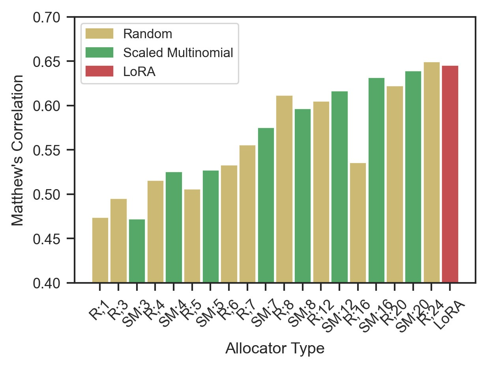

# FoMo-LoRA

In this project we explored the training dynamics of Parameter-Efficient Fine-Tuning (PEFT) methods, with an emphasis on Low-Rank Adaptation (LoRA). Mainly, we wanted to evaluate, whether it is possible to further reduce memory overhead of fine-tuning by selectively deactivating gradient updates for certain modules during training. In our method, we measured either activation magnitude of the adapted layers in the forward pass, or the gradient magnitude of the same vector in the backward pass. After aggregating these measurements using the L2 norm, we regarded them as *importance* measures and used them to dynamically select modules to update during training.

Our results show, that we can effectively reduce the number of updated parameters during training by $~50\%$ without sacrificing performance. We also found that the choice of importance measure has little impact on the performance. In fact, we showed that even with uniform random resouce allocation, we can achieve similar performance as baseline LoRA.



## Installation

To install the requirements for FoMo-LoRA, run the following commands:

```bash
git clone https://github.com/JesseBrouw/FoMo-LoRA.git
cd FoMo-LoRA
scripts/setup.sh
```

## Usage

To use FoMo-LoRA, inspect the help message of the `train` module as well as the provided job files in `scripts`:

```bash
python -m src.train --help
```

## License

This project uses the following license: [license_name](link).
